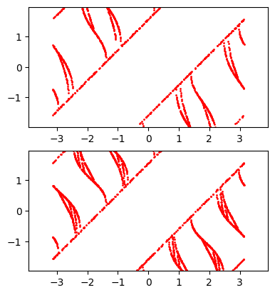
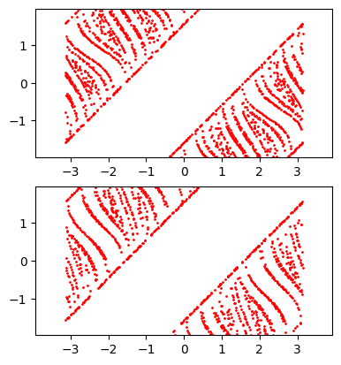
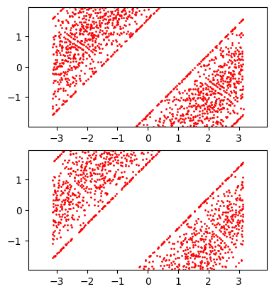
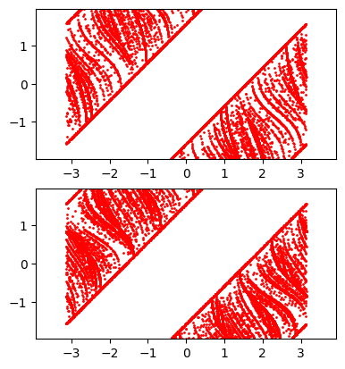
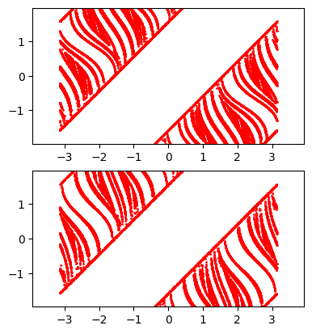

# Singularity Plots

Let $\mathcal{S}\_{0}= \set{(r,\varphi)\in M\ |\ \varphi=\pm \frac{\pi}{2}}$ be the set of initial conditions with grazing collisions. Then the singularity curves at collision/time-step $n\geq 1$ is the set $$\mathcal{S}\_{n}=\bigcup^n\_{i=0} T^i(\mathcal{S}\_{0}).$$

## System Parameters
Boundary dimensions are $6\times 6$

Scatterer 1 (Center Scatterer) has radius $r_1 = 2$

Scatterer 2 (Corner Scatterer) has radius $r_2 = 1.5$

## Image Set 1
These set of images had an initial set $\mathcal{S}\_{0}$ of size 3998 (~2000 trajectories generated for each scatterer)

This is the plot of $\mathcal{S}\_{1}$

Plot of $\mathcal{S}\_{2}$

Plot of $\mathcal{S}\_{3}$

## Image Set 2
These set of images had an initial set $\mathcal{S}\_{0}$ of size 39998 (~20000 trajectories generated for each scatterer)

Plot of $\mathcal{S}\_{1}$

Plot of $\mathcal{S}\_{2}$

