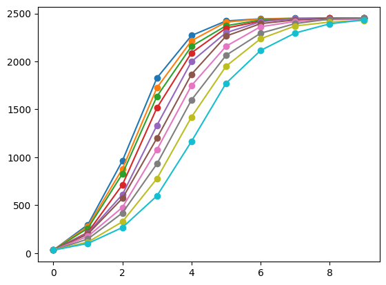
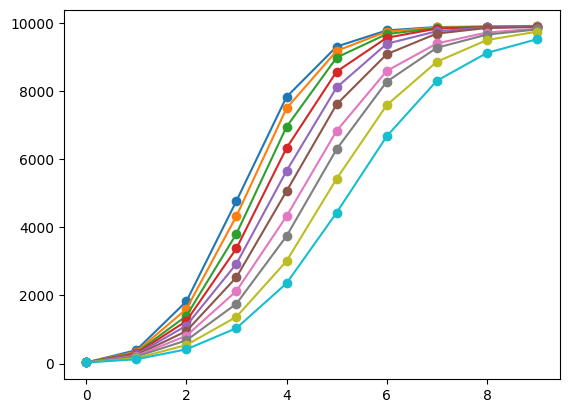
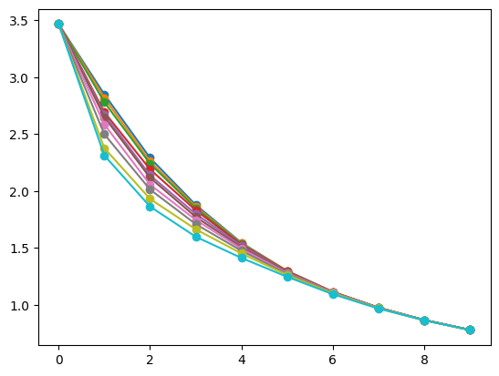
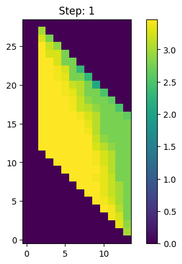
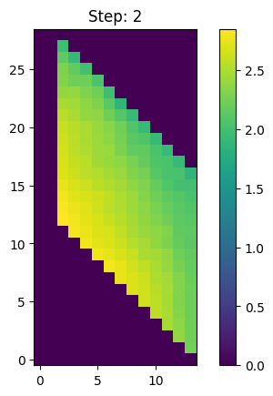
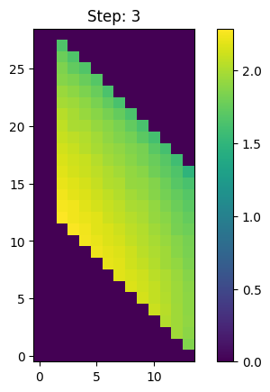
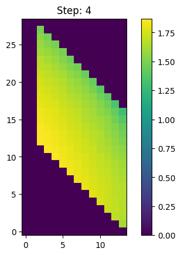
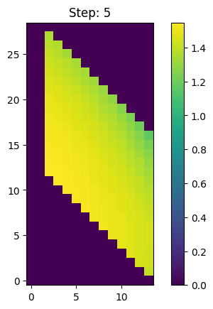
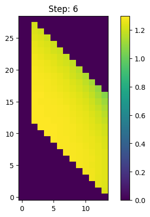
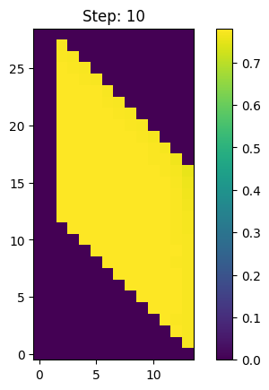

<!-- TO INCLUDE 
- Animation of how size of accepted sequences change for each set of parameters as number of collisions increases
    - Include both unmodified values and logarithmic ones
-->

I spent last week getting the code ready for running large numbers of simulations so we will be able to compare sizes of accepted sequences with the different parameter values.
This week I spent the majority of my time running those simulations and putting together visualizations to help understand these results better.

# Basic Plots

First, I tried to see how the size of $M_s$, the set of accepted accepted sequences at the $s$-th collision changes as the radius of one scatterer is fixed and the other is varied.

In these two figures, I fixed the radius of the center scatterer to be $r_1\approx 2.14$ and had 10 values for $r_2$ uniformly spaced between $0.87$ and $1.84$ which were just chosen because $2.14$ and $0.87$ were the smallest possible values for the radii. For each pair of parameters, I then simulated $m$ different $\theta$ values with $n$ different $\phi$ values starting from the center scatterer, then recorded the size of $M_s$, with $s$ being from 1 to 10.

The first figure has $m=n=50$

The second figure has $m=n=100$

In both images, the top line has the smallest value for $r_2$ and the bottom has the largest $r_2$ that was used.

I noticed that the size of $M_s$ increases as $r_2$ decreases when $r_1$ is fixed, however they start to converge to the same value towards the end, which is likely because we are now limited by the number of trajectories tested. Most values I've individually tested all look similar to this sigmoid-like curve, no matter how many trajectories I generate or how many collisions I iterate through.

Lastly, for these basic plots I then plotted the values of the first graph but after taking the logarithm of them and dividing by how many collisions it has undergone at that point.

# Heat Maps

Now that I had an idea as to how the size of $M_s$ correlates with the system parameters when one of them is fixed, I wanted to see how they would look like if both radii were varied. To do this, I came up with using a heatmap since I was using discrete values and it would be a lot better at visualizing the topological entropy for each pair of parameters than a 3d plot or a set of 2d line plots similar to the previous section.

For these sets of images each grid is a separate pair of radii values, with the x-axis being the radius of the center scatterer and the y-axis being the radius of the corner scatterers. 

The axes of the plot are currently misleading; They are just the index of parameter values in a matrix and not the size of the scatterers themselves. Each point has a step size of 0.075, with values of the center scatterer's radius being in the range of [2, 3] and the corner's being in the range of [0, 2], which misses some parameter values but should cover most of them.

At the moment I have only considered the case where the center scatterer is larger, just so I could save time on running these numerical simulations. I do plan on checking the case where the corner scatterer is larger soon.

I've also included the heat maps that just plot the sizes of the number of accepted sequences here [ADD LINK TO FOLDER OF IMAGES]

# Conclusion

Since it's clear that we will be very limited by the numerical simulations, we could probably use the 'rate' at which the size converges to the number of trajectories to qualify the topological entropy of the system.

